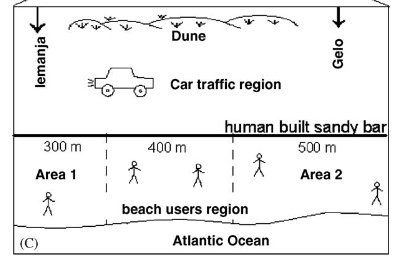
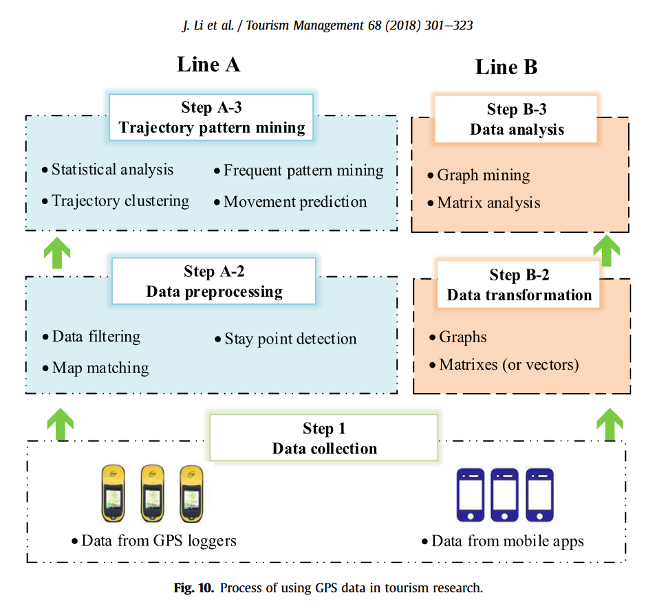

```{r setup, include=FALSE}
knitr::opts_chunk$set(echo = TRUE)
```

```{=html}
<style>
body {
text-align: justify}
</style>
```
# Preface

This document is to serve as a selection of summaries of literature that I regard as potentially very related to the research themes in this project.

## [@santos2005]

This paper from 2005 relates to research from Brazil in 2003. Based in the south of Brazil the aim of this research was threefold. The researchers aimed to determine the characteristics of people who engage in littering, as well as the perceptions of people to the problem of litter on the beach. To achieve this they used a mix of qualitative and quantitative methods, including handing out a survey to beach visitors, sampling the characteristics of visitors to the beaches over a period of time, and sampling the level of litter on the beaches over the same period of time. The results indicated that people's primary concern was relating to the dangers to humans caused by littering. They also found that when a beach was visted by increased levels of low-income and low-education people, the levels of litter increased relative to the base line.

In my opinion this research is limited to not exploring if national background caused differentiation in littering behaviour, it is potentially outdated, the statistical modelling is very simplistic (bivariate regression), and more beaches could be surveyed. However, this paper does get bonus points for including the best visulisation I have seen in a while.

<center>

{width="533"}

[@santos2005]

</center>

## [@kedzierski2020]

This review paper goes over the existing literature on why people may leave litter in the environment. It also looks at the history of anti-littering interventions, evaluating the success and failure of such measures. I think the utility of this paper is found in its ability to contextualise the problem of littering in plain terms. Furthermore, this paper can serve as a good basis to find more specific research on the topic, through looking at the other work it cites. They do end the paper on the rather somber note, emphasising the urgency of research and policy on this issue:

*"Our descendants will have to face a daunting legacy and will seek the reasons why we were unable to find strategies to effectively solve the problem of plastic end of life."* [@kedzierski2020, p. 8]

## [@li2018]

This paper explores the new trend of working with "big data" in tourism research. An emerging field of study in the 21st century, big data relates to the hitherto unimaginable amount of scale of datasets gathered from contemporary digital information, such as GPS information. For tourism studies, the authors the trend of papers published using "big data" and breakdown the types of data used in these studies. For instance, and potentially relevant to this research, they find that around 22% of all studies employed GPS tracking data to study mobility trends in the tourism industry. The largest category of data is UGC or "User Generated Content" like online reviews (it may be possible to explore this too by scraping review sites on the beaches for reference to litter).

Going into more detail on the use of GPS data, they provide this helpful info-graphic:

<center>



[@li2018]

</center>

In my opinion, this paper is an invaluable guide for me during this project. Notably, its insights and references to studies employing a variety of data collection and wrangling techniques within tourism studies is extremely compelling to me. It is my hope that I will be able to marry this study to the field of garbage research.

## [@araújo2019]

At the time of this paper's publication, the authors note that annually "4.5 trillion cigarettes are littered in the environment."

# Bibliography
